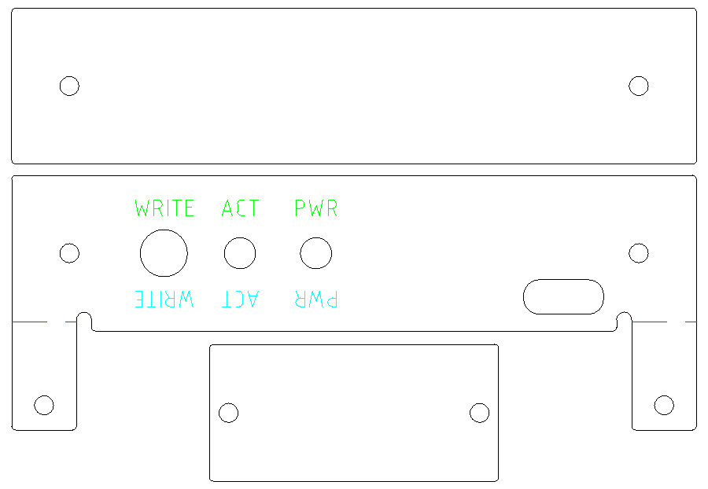
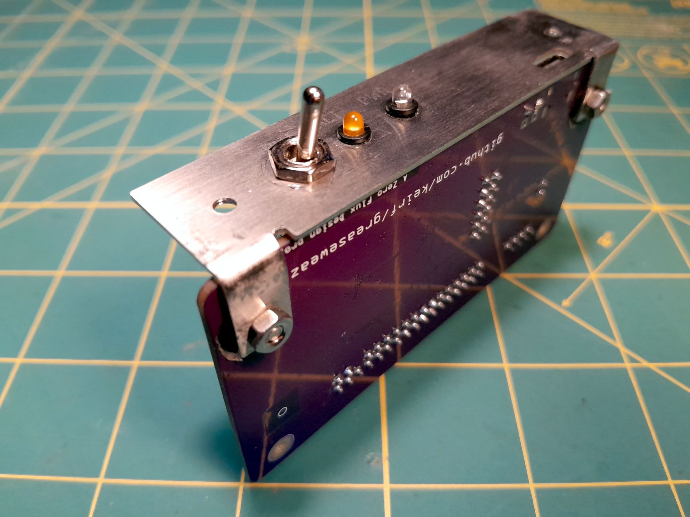
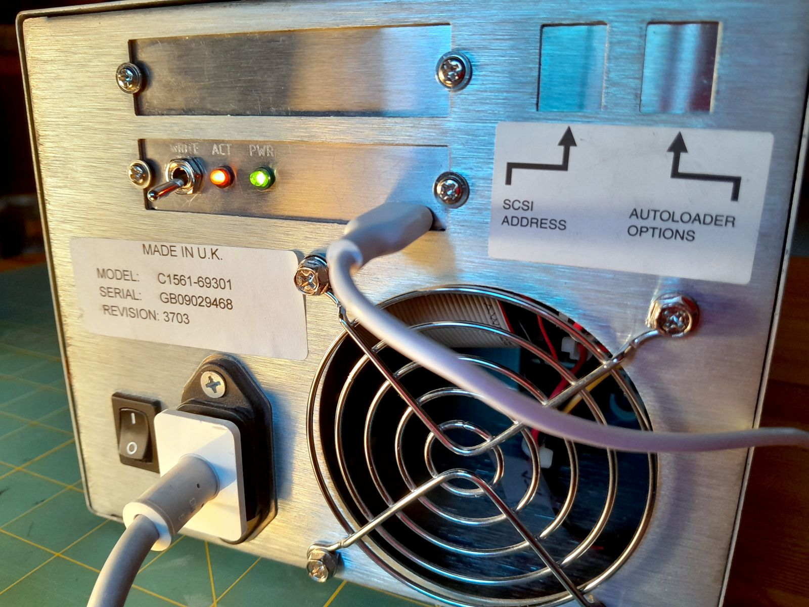

# Greaseweazle brackets for SCSI enclosures

If you're like me, you've installed your [Greaseweazle](https://github.com/keirf/greaseweazle) in an old SCSI enclosure, but the circuit board flopping around inside and the wires dangling out of holes in the case bothers you. If you're *unlike* me, you haven't gotten around to addressing that. Lucky you!

Okay, so this is just a set of CAD drawings:

* One is for a bracket to hold the Greaseweazle circuit board, and to expose the USB-C port to the outside of the case. There are also holes for a write enable switch as well as LEDs for power and activity. It is designed to fit into a hole that was previously used for a 50-pin Centronics SCSI port.
* Another is a blanking plate for the second ex-SCSI port, if needed.
* The third is a small plate for covering the SCSI address selector. My enclosure was previously a tape autoloader, so there were two selectors to cover. You can resize this plate if your needs differ.

The mounting holes for the two Centronics plates are set at 74.85mm c-to-c. This should work in a lot of cases, but this dimension isn't standardized, so check your enclosure and make any needed adjustments before getting your parts cut.

The red dotted lines on the main bracket are an **estimate** of where to bend at a 90° angle to support the Greaseweazle board. The company I used for the cutting could have used these lines to bend on, but I chickened out and did it manually, so **these lines are not confirmed to be correct**. If the legs aren't bent at just the right place, it'll be more difficult to line up the USB-C port.

The top & bottom labels for the switch and the LEDs are each on a separate layer, so you can opt to have them engraved right side up, upside down, both, or neither.

# Assembly

Part | Manuf. | Part # | Mouser
-|-|-|-
Toggle switch | Shin Chin | 55TA101A1-B | [link](https://www.mouser.com/ProductDetail/112-55TA101A1-B)
Green panel-mount LED (PWR) | Bivar | PM3GCW6 | [link](https://www.mouser.com/ProductDetail/749-PM3GCW6)
Amber panel-mount LED (ACT) | Bivar | PM3ADW6.0 | [link](https://www.mouser.com/ProductDetail/749-PM3ADW6)

Plus two resistors of about 100Ω each.

The Greaseweazle offers pads for external LEDs, but the positive leads go through the same high-value resistors as the onboard LEDs, which will leave your externals extremely dim. Instead, connect the negative leads of both LEDs to the appropriate pad on the board, then connect the positive leads through a current-limiting resistor to +5V.

The pins on the header for write enable are marked. Connect the switch there.

All of the mounting holes are designed to be 2.5mm in diameter to allow for use of an M3 tap.

